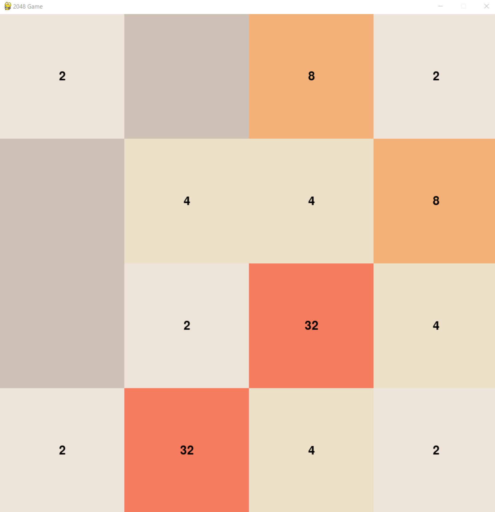

# Pygame 2048 -  Client Part
An over-engineered version of the famous [2048 video game](https://en.wikipedia.org/wiki/2048_(video_game)) 
on a server with a C backend and a Python front end client.



# Setup
Create a `.env` file and add the Ip and port. 
```
TCP_IP=<SERVER-IP>
TCP_PORT=<SERVER-PORT>
```
Install the packets in the `requirements.txt`.

# Controls 
- The arrow keys: left, right, up and down 
- ESC to exit the game. 

# Communication

```
When a client connects, the server sends an initial server message.
After that, the server waits for a client message and will send a server message in response.

Client -> Server (2 B)
    1 Byte Type: 0x1
    1 Byte Direction:
        Up: 0x0
        Right: 0x1
        Down: 0x2
        Left 0x3
        Quit: 0x4

Server -> Client (22 B)
    1 Byte Type: 0x0
    1 Byte State:
        Playing: 0x0
        Won: 0x1
        Lost: 0x2
    4 Byte Score: unsigned int
    16 Byte Board: exponent of powers of 2
```


